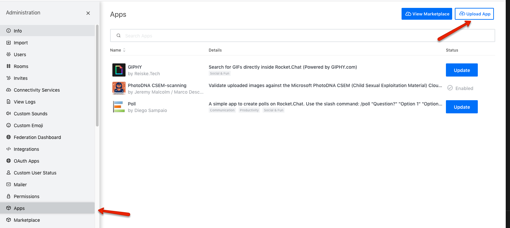
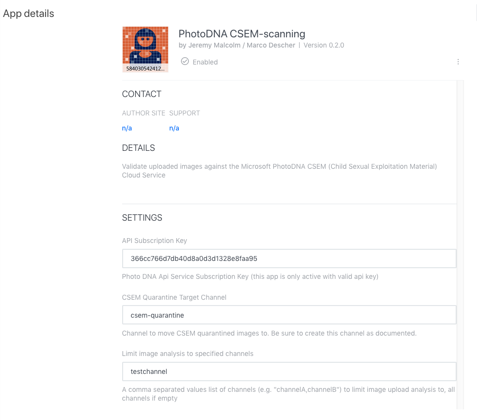
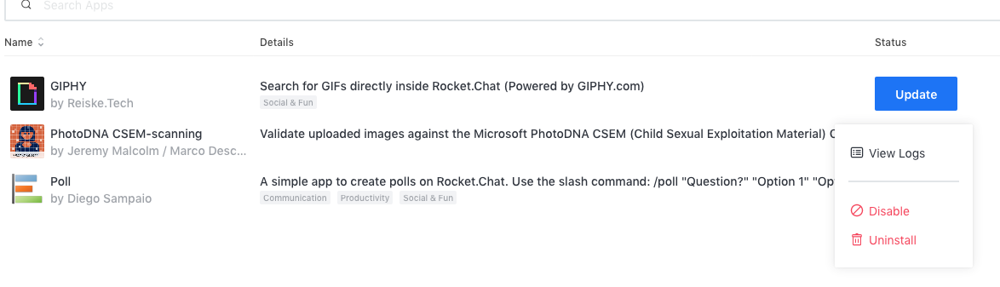

PhotoDNA CSEM scanning App
==========================

*v0.3.0 - January 2021* - requires Rocketchat 3.8.0 or newer

This RocketchatApp does validate uploaded images against the [Microsoft PhotoDNA cloud service](https://www.microsoft.com/en-us/photodna)

Image validation happens before the actual message is being shown. Images that match against the service are quarantined to a given room/channel for further treatment.

Installation
============

The plugin is distributed as a [Rocketchat App](https://docs.rocket.chat/guides/rocket-chat-apps). Installation can be carried out by the administrator via the `Setings / Apps / Upload App` util, as shown in the following image.

The resp. source of your installation depends on the distribution scenario.

Obtaining the required configuration credentials
================================================

* The PhotoDNA credentials can be acquired via https://www.microsoft.com/en-us/photodna/cloudservice.
* To receive the NCMEC credentials for automated report functionality, write an email to espteam@ncmec.org to request the registration form.

Configuration
=============

As Administrator go to Rocketchat settings / Apps and click on `Photo DNA CSEM-scanning`. This will open the app details page:

In `API Subscription Key` you have to enter your api key - the service will not be active without the key. This corresponds to the *primary key* received
during the PhotoDNA registration.

In `CSEM Quarantine Target Channel` you have to provide the link to a channel where quarantined messages will move to. Please be sure to have this channel
created like shown in the following image:

If the target channel does not exist, the image will be removed from the message.

In `Limit image analysis to specified channels` you may provide a comma-separated-list of channels to limit the analysis to. In the depicted setting, only images uploaded in the channel `testchannel` will be subject to investigation by this app.

Preventing child sexual abuse
=============================
For information on protecting your users who are at risk of being caught up in child sexual abuse, either as a victim or as a potential perpetrator, [Prostasia Foundation](https://prostasia.org) can help. We offer consulting services to platforms to help them eliminate abuse without interfering with the free speech of legitimate users. Our [Get Help page](https://prostasia.org/get-help) also offers a variety of support options for users, including the MAP Support Chat forum for which this app was originally developed.

Further information
===================

The App does generate a sequence of logs, which can be accessed by clicking on the 3 vertically oriented buttons on the app page:

Changelog
=========
* 0.2.0 
  * Allow to limit analysis to specific rooms
* 0.2.1
  * Optimistic removal of `Converting circular structure to JSON`
* 0.2.2
  * Limit analysis to room names setting is now case-insensitive
  * Fix `Converting circular structure to JSON` bug
* 0.2.3
  * Added information about CSAM prevention resources
* 0.3.0
  * Added automated report functionality (configurable)

Todos / Caveat
==============

* Currently the user posting the matching image does not see any actions happening, just the message not occuring.
* The images are transported to the Microsoft PhotoDNA Service. The Edge-Hash algorithm is not implemented.
* App logging is too verbose at the moment https://github.com/RocketChat/Rocket.Chat/issues/13312
* Real user IP is not available for automated report functionality https://github.com/RocketChat/feature-requests/issues/433
